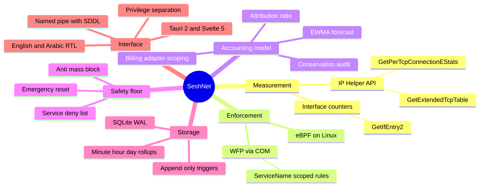
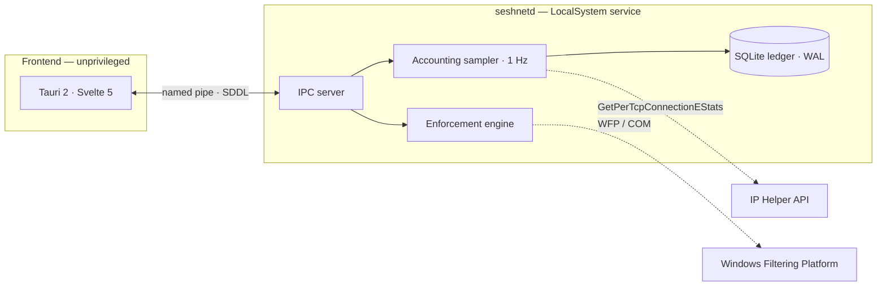
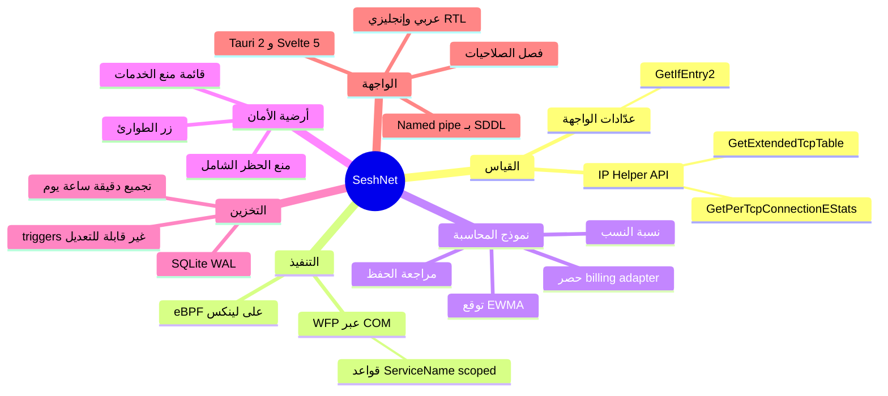

# SESH NET

  
  

  

**Per-process network traffic accounting and per-application firewall for Windows and Linux.**

[English](#overview) · [العربية](#بالعربية)

---

## Overview

SeshNet is a local-first network traffic accountant and per-application firewall. It attributes bandwidth consumption to individual processes in real time, keeps an append-only usage ledger, and enforces per-process blocking through the native OS filtering APIs: the Windows Filtering Platform on Windows, and eBPF on Linux. All measurement and enforcement happens on the local machine. No telemetry or usage data leaves the host.

I built SeshNet to solve a specific problem on metered connections: the operating system's built-in usage figures under-report real consumption. They omit protocol overhead and never reconcile against what the ISP actually measures at the interface. SeshNet treats the interface byte count as the source of truth, reports per-process attribution as a measured subset of it, and shows the difference instead of hiding it.

## System map

## How it works

SeshNet is organized into six layers. Each one is described in terms of the OS mechanisms underneath it.

### 1. Per-process measurement [IP Helper API]

On Windows, per-process traffic is read through the IP Helper API [`iphlpapi.dll`]:

- `GetExtendedTcpTable` returns the table of active TCP connections, each tagged with its owning process ID. This maps every connection to a process.
- `GetPerTcpConnectionEStats` returns extended per-connection counters, including `DataBytesIn` and `DataBytesOut`. These counters are cumulative since the connection was created, so the sampler takes the difference between consecutive samples instead of the raw values.
- Collection has to be enabled per connection first with `SetPerTcpConnectionEStats` [`EnableCollection = TRUE`]. Without this step the counters return no data.

A background sampler runs at 1 Hz: it walks the connection table, computes per-connection byte deltas, aggregates them per process, and flushes the result to the ledger. This path covers TCP only. UDP and other protocols cannot be attributed to a process from user space, so they land in the overhead term [see below].

### 2. Interface ground truth

The reference consumption figure is read from the network interface itself [`GetIfEntry2`], which reports total octets in and out. This is the quantity an ISP measures and bills. Billing-adapter detection [`GetAdaptersAddresses` + `GetIpForwardTable2`] scopes accounting to the adapter carrying the default route, so loopback, virtual, and VPN adapters do not inflate the total.

### 3. The accounting model

Let $B_{\text{interface}}$ be the interface byte total, $\sum_i B_i$ the sum of per-process attributed bytes, and $B_{\text{overhead}}$ everything else [protocol headers, retransmissions, UDP, DNS, and traffic that cannot be pinned to a process]. These are related by:

$$B_{\text{interface}} = \sum_i B_i + B_{\text{overhead}}$$

A naive design defines $B_{\text{overhead}} := B_{\text{interface}} - \sum_i B_i$, which makes the identity hold by construction and proves nothing. SeshNet avoids this tautology. It reports the attribution ratio

$$r = \frac{\sum_i B_i}{B_{\text{interface}}}$$

as the quality measure, and presents $B_{\text{overhead}}$ as a named slice instead of claiming an exact conservation that is true by definition.

The renewal forecast comes from a robust estimator, an exponentially weighted moving average:

$$\hat{x}_t = \alpha\, x_t + (1-\alpha)\,\hat{x}_{t-1}$$

[or a median over the last $N$ days]. It is shown as a range, so a single heavy-download day does not wreck the prediction.

### 4. Enforcement [WFP on Windows, eBPF on Linux]

**Windows.** Blocking goes through the Windows Filtering Platform, controlled from user space via the COM API [`INetFwPolicy2`, `fwpuclnt.dll`]. SeshNet installs firewall rules that match a process and drop its traffic in the chosen direction. Two details matter:

- **Service-level granularity.** `INetFwRule` exposes a `ServiceName` field. Setting it scopes a rule to a single service hosted inside `svchost.exe`, which hosts dozens of services in one process, without affecting its siblings. This is what lets you stop Delivery Optimization's P2P seeding while leaving DHCP and DNS intact.
- **Resource safety.** A RAII guard guarantees `CoUninitialize` runs on every exit path, so COM threads and `VARIANT`s do not leak as rules are added and removed.

**Linux.** The backend is written against `libbpf-rs` with a C eBPF program [`ebpf/seshnet_counter.c`] that counts bytes in pinned BPF maps [`percpu_counter_map`, `policy_map`] under `/sys/fs/bpf/`. This path is implemented but not yet compiled or verified [see Limitations].

### 5. Privilege separation

The daemon [`seshnetd`] runs as a Windows service under LocalSystem. The Tauri/Svelte front end runs unprivileged. They talk over a named pipe [`\\.\pipe\seshnet_ipc`] protected by a hardened SDDL security descriptor that restricts access to administrators. Every mutating request [block, unblock, configuration change] is authorized in the daemon with `CheckTokenMembership` against the caller's impersonation token, not by comparing SID strings, which would match no real user.

### 6. The ledger

Usage is persisted in SQLite in WAL [write-ahead logging] mode, which allows concurrent reads during writes without lock contention. Performance pragmas set a 64 MB page cache and in-memory temp storage. Raw samples are rolled up minute → hour → day inside atomic transactions. The audit table carries `BEFORE UPDATE` and `BEFORE DELETE` triggers that issue `RAISE(ABORT)`, making recorded telemetry append-only. It cannot be rewritten, even by a compromised front end.

## Technology foundations

| Technology | Role in SeshNet | Why it |
|---|---|---|
| **IP Helper API** | Per-process TCP byte counters | The only user-space source of per-connection bytes on Windows; no driver required |
| **Windows Filtering Platform** | Per-process / per-service packet blocking | The OS-native filtering stack; rules survive reboots and apply below user space |
| **eBPF** [Linux] | In-kernel byte counting and policy | Line-rate accounting without a kernel module; the standard modern data-plane tool |
| **Named pipes + SDDL** | Privileged IPC | Kernel-enforced access control on the channel itself |
| **SQLite WAL + triggers** | Append-only telemetry | Embedded, zero-config, with database-level immutability guarantees |
| **Tauri 2 + Svelte 5** | Unprivileged UI | Small binary, native webview, no bundled browser engine |

## Comparison with existing approaches

SeshNet is positioned against categories of tools, not specific products:

| Approach | What it measures | Limitation | How SeshNet differs |
|---|---|---|---|
| **OS built-in usage meters** | Per-app totals | Not real-time; omit overhead; never reconcile with the ISP figure; no conservation model | Wire-level totals, named overhead, attribution ratio, live sampling |
| **Connection / process monitors** | Per-connection or per-process activity | Observe only; no enforcement; no reconciliation against the interface | Measurement and enforcement, reconciled against interface truth |
| **Simple firewall front-ends** | Rules | Block without measuring; no safety floor; can lock the user out of their own network | Measured blocking with a server-side deny-list and an emergency reset |
| **Enterprise network appliances** | Network-wide traffic | Require dedicated hardware, agents, and infrastructure; not for an individual machine | Single-machine, local-first, no cloud, no agents |

What sets it apart: [1] wire-level honesty, where the interface total is the source of truth and the overhead is named; [2] per-service granularity inside `svchost.exe`; [3] a safety floor that prevents self-lockout; [4] privilege separation, not just a GUI over the firewall; and [5] an append-only ledger.

## Architecture

## Features

- Real-time per-process TCP accounting at 1 Hz, with per-connection deltas.
- Interface-level plan totals as ground truth, reconciled via an attribution ratio.
- Per-application blocking, permanent or time-bounded [1 h / 4 h / 24 h / custom].
- Per-service blocking inside `svchost.exe` via `ServiceName`-scoped rules.
- A server-side deny-list protecting critical network services [DHCP, DNS, WLAN, cryptographic services].
- Foreground/background classification [rolling-window foreground tracking] to surface hidden background drainers.
- Rate-normalized spike detection against a per-app baseline.
- Append-only SQLite ledger with minute/hour/day rollups.
- Privilege-separated architecture over an SDDL-hardened named pipe.
- English and Arabic interface with full RTL support.
## Screenshot
<table>
  <tr>
    <td></td>
    <td></td>
  </tr>
  <tr>
    <td></td>
    <td></td>
  </tr>
</table>
## Installation

### Release binaries

Download the latest release from the [releases page](https://github.com/to29y/SeshNet/releases/latest).

## Limitations & status

| Component | Status |
|---|---|
| Windows daemon | Implemented; unit-tested [22/22 passing] |
| Windows end-to-end verification | In progress |
| Linux eBPF backend | Implemented; not yet compiled or verified [Windows-only development environment] |
| Gateway mode | Planned |

Known technical limits:

- **TCP-only attribution.** Per-process accounting covers TCP. UDP and unattributable traffic are reported in the overhead term, not assigned to processes.
- **Local scope.** Per-process visibility is inherently local to the machine running SeshNet. Network-wide, per-device visibility requires the planned gateway mode.
- **Linux unverified.** The eBPF path needs a real kernel [≥ 5.8, BTF, cgroup v2] to build and test.

## Future work

A planned gateway mode would let a single host acting as the network gateway measure and shape traffic for every device on the network, including mobile devices, without per-device agents. Classification would use flow metadata [TLS SNI, DNS queries, DHCP fingerprinting, MAC OUI] instead of payload inspection, with per-device rate limiting and blocking applied at the bridge. This is at the design stage.

## Tech stack

| Layer | Technology |
|---|---|
| Daemon | Rust, Tokio, `windows-rs` [WFP / COM / IP Helper], `rusqlite` |
| Frontend | Tauri 2, Svelte 5, TypeScript, Vite |
| Data | SQLite [WAL], append-only triggers |
| Localization | English, Arabic [RTL] |

## Contributing

Contributions are welcome. Please open an issue before large changes. The Linux eBPF path in particular needs verification on real hardware.

## License

See [LICENSE](LICENSE).

## Support

Support SASH NET 💖

  

  

 

**ABDULRAHMAN TONY** · [AbdulrahmanTony.com](https://AbdulrahmanTony.com) · [@AbdulrahmanTony](https://t.me/AbdulrahmanTony)

---

## بالعربية

### إيه هو SeshNet؟

تطبيق بسيط لويندوز ولينكس، بيخليك تشوف كل برنامج على جهازك بيستهلك قد إيه من الإنترنت، وبتقدر بضغطة زرار واحدة تقفل النت عن أي برنامج بيسحب الباقة من غير ما تأثر على بقية الإنترنت داخل جهازك.

### ليه هتحتاجه؟

- **عشان تعرف الباقة بتروح فين:** بيحسبلك الاستهلاك الحقيقي لكل برنامج بدون عشوائية.
- **تقفل النت عن أي برنامج بضغطة واحدة:** تقفله نهائياً أو تعمل حظر مؤقت [ساعة، 4 ساعات، 24 ساعة].
- **يحميك من مستهلكات الخلفية:** كشف وإيقاف تحديثات ويندوز الصامتة وخدمات الخلفية المزعجة.
- **خصوصية 100%:** مفيش أي سيرفرات خارجية ولا تتبع، كل بياناتك بتتحسب على جهازك وبس.

---

SeshNet محاسب محلي لحركة الشبكة وجدار ناري على مستوى التطبيق. ينسب استهلاك bandwidth إلى كل process في الوقت الفعلي، ويحتفظ بسجل استخدام غير قابل للتعديل، وينفّذ الحظر لكل تطبيق عبر واجهات التصفية الأصلية لنظام التشغيل: Windows Filtering Platform على ويندوز، وeBPF على لينكس. كل القياس والتنفيذ يتمّان على الجهاز المحلي، ولا تغادر أي بيانات الجهاز.

طوّرتُ هذه الأداة لحل مشكلة محددة على الاتصالات محدودة الباقة: أرقام الاستهلاك المدمجة في نظام التشغيل أقل من الواقع، لأنها تُسقط protocol overhead ولا تُطابق ما تقيسه شركة الإنترنت على مستوى الواجهة. SeshNet يتعامل مع عدد البايتات على الواجهة كرقم مرجعي، ويعرض الاستهلاك لكل تطبيق كجزء مُقاس منه، ويُظهر الفرق بدل إخفائه.

### خريطة النظام

### كيف يعمل [علمياً]

**١. القياس لكل process [IP Helper API].** على ويندوز، تُقرأ حركة كل process عبر `GetExtendedTcpTable` [ربط كل اتصال TCP بالـ process صاحبها] و`GetPerTcpConnectionEStats` [عدّادات البايت لكل اتصال]. العدّادات تراكمية منذ إنشاء الاتصال، فيحسب الـ sampler الفرق بين العينات كل ثانية. يجب أولاً تفعيل الجمع عبر `SetPerTcpConnectionEStats`. هذا المسار يغطي TCP فقط؛ أما UDP فيُعرض في بند الـ overhead.

**٢. المرجع على مستوى الواجهة.** الرقم المرجعي هو إجمالي البايتات على الواجهة [`GetIfEntry2`]، وهو ما تقيسه شركة الإنترنت. كشف billing-adapter [`GetAdaptersAddresses` + `GetIpForwardTable2`] يحصر الحساب في الواجهة التي تحمل الـ default route، فلا تُحتسب واجهات loopback أو VPN.

**٣. نموذج المحاسبة.** إذا كان $B_{\text{interface}}$ إجمالي الواجهة و$\sum_i B_i$ مجموع المنسوب لكل process، فإن:

$$B_{\text{interface}} = \sum_i B_i + B_{\text{overhead}}$$

تعريف $B_{\text{overhead}}$ بالطرح يجعل المطابقة صحيحة بحكم البناء فلا تثبت شيئاً. لذلك يعرض SeshNet نسبة النسب:

$$r = \frac{\sum_i B_i}{B_{\text{interface}}}$$

كإشارة جودة، ويُظهر $B_{\text{overhead}}$ كبند مسمّى. التنبؤ بالتجديد يُشتق من متوسط متحرك أُسّي $\hat{x}_t = \alpha x_t + (1-\alpha)\hat{x}_{t-1}$ ويُعرض كنطاق.

**٤. التنفيذ [WFP / eBPF].** على ويندوز، يُنفَّذ الحظر عبر Windows Filtering Platform بواجهة COM [`fwpuclnt.dll`]. الخاصية `ServiceName` في `INetFwRule` تحصر القاعدة في خدمة واحدة داخل `svchost.exe` [الذي يستضيف عشرات الخدمات في process واحد] دون التأثير على أخواتها. على لينكس، يعدّ برنامج eBPF البايتات في BPF maps مثبتة تحت `/sys/fs/bpf/` [مكتوب ولم يُتحقق منه بعد].

**٥. فصل الصلاحيات.** يعمل الـ daemon بصلاحيات LocalSystem، والواجهة بلا صلاحيات، والتواصل عبر named pipe محمي بـ SDDL. كل طلب تعديل يُصرَّح به في الـ daemon عبر `CheckTokenMembership` على impersonation token الخاص بالمتصل.

**٦. السجل.** SQLite بوضع WAL مع تجميع دقيقة ← ساعة ← يوم في معاملات ذرية، وtriggers من نوع `BEFORE UPDATE/DELETE` تصدر `RAISE(ABORT)`، فيصبح السجل غير قابل للتعديل حتى لو اختُرقت الواجهة.

### مقارنة بالنُهج الموجودة [بالفئات، لا بالأسماء]

| النهج | ما يقيسه | قصوره | كيف يختلف SeshNet |
|---|---|---|---|
| عدّادات النظام المدمجة | إجماليات لكل تطبيق | ليست لحظية؛ تُسقط الـ overhead؛ لا تُطابق رقم الشركة | إجماليات على مستوى السلك + overhead مسمّى + نسبة نسب |
| مراقبات الاتصالات/العمليات | نشاط لكل اتصال أو process | رصد فقط؛ بلا تنفيذ؛ بلا مطابقة مع الواجهة | قياس وتنفيذ مطابَق لمرجع الواجهة |
| واجهات الجدار الناري البسيطة | قواعد | تحظر بلا قياس؛ بلا أرضية أمان؛ قد تحبسك عن شبكتك | حظر مُقاس مع deny-list من جهة الخدمة وزر طوارئ |
| أجهزة المؤسسات الشبكية | حركة الشبكة كلها | تحتاج عتاداً وagents وبنية تحتية | جهاز واحد، محلي، بلا سحابة، بلا agents |

### الحالة والحدود

| المكوّن | الحالة |
|---|---|
| Windows daemon | مُنفَّذ؛ مختبَر وحدوياً [22/22] |
| التحقق النهائي على ويندوز | جارٍ |
| Linux eBPF backend | مُنفَّذ؛ لم يُبنَ أو يُتحقق منه بعد |
| وضع البوابة | مخطَّط |

الحدود التقنية: القياس لكل process يغطي TCP فقط [UDP في الـ overhead]؛ الرؤية لكل process محلية بطبيعتها [الرؤية الشبكية الشاملة تتطلب وضع البوابة المخطَّط]؛ ومسار لينكس يحتاج نواة حقيقية [≥ 5.8] للبناء والاختبار.

### التثبيت

حمّل أحدث إصدار من [صفحة الإصدارات](https://github.com/to29y/SeshNet/releases/latest)

### الدعم

إدعم ساش نت 💖

  

  

 

**عبدالرحمن توني** · [AbdulrahmanTony.com](https://AbdulrahmanTony.com) · [@AbdulrahmanTony](https://t.me/AbdulrahmanTony)

